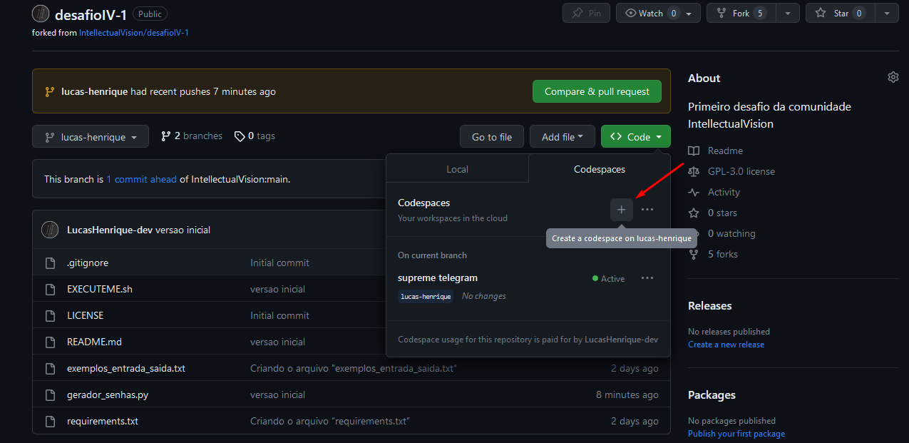
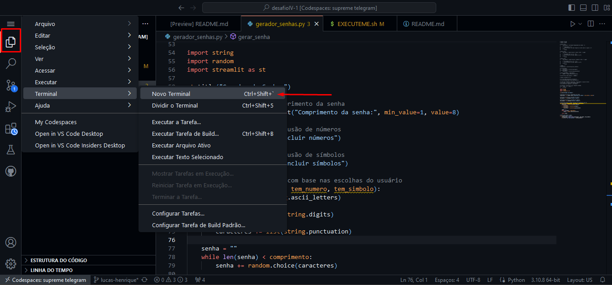
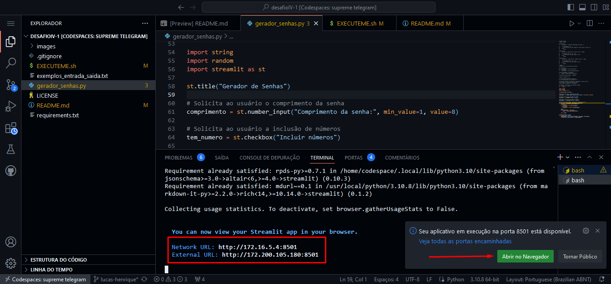

# Gerador de Senhas Python 🐍


## ℹ Tabela de Conteúdos
- [Desafio](#dart-desafio)
- [Especificações](#-especificações-do-projeto)
- [Como Usar](#-como-usar-o-gerador-de-senhas)

## :dart: Desafio

Neste desafio, você será convidado a criar um programa em Python que seja capaz de gerar senhas aleatórias, seguindo critérios definidos pelo usuário. A proposta é oferecer às pessoas uma ferramenta simples e personalizável para criar senhas seguras, visando a proteção de suas contas online e informações pessoais.

O programa deve permitir ao usuário especificar os seguintes requisitos:

- Comprimento desejado para a senha.
- Se a senha deve incluir números.
- Se a senha deve incluir símbolos.

A saída esperada do programa é uma senha que atenda aos critérios definidos pelo usuário.

## 📃 Especificações do Projeto

O projeto usa as Bibliotecas:
- string
- random
- streamlit

## ☕ Como uasr o Gerador de Senhas

Para usar a Gerador de Senhas, siga estas etapas:

1. Crie um codespace:
    * Clique em "Code" e depois na opção "Create a codespace on _lucas-henrique_", onde _lucas-henrique_ é a branch em que se está trabalhando no momento </br>
    
1. Caso não esteja familiarizado com a plataforma e não saiba onde fica o terminal, siga a próxima etapa
1. Para criar um novo terminal siga os passos:
  1. Usar atalho:
    1. Aperte nas teclas ```Ctrl+Shift+´```
  1. Usar ícones do Codespaces:
    1. Clique no símbolo de três linhas na barra lateral esquerda
    1. Clique em "Terminal"
    1. Clique em "Novo Terminal"
    1. O passos devem se parecer com:
      
1. Configurar permissões do projeto:
      * Use o seguinte comando
        ```shell
        chmod 777 ./EXECUTEME.sh
        ```
        > O comando acima permite o usuário ler, escrever e executar o arquivo EXECUTEME.sh o qual encapsula os comandos necessários para fazer o gerador funcionar.
1. Executar o programa:
      * Use o seguinte comando
        ```shell
        ./EXECUTEME.sh
        ```
        > O comando acima permitirá testar o Gerador de Senhas Python.
1. Clique no botão __Abrir no Navegador__ ou use um dos links exibidos no terminal:
  

## 📝 Licença

Esse projeto está sob licença. Veja o arquivo [LICENÇA](LICENSE) para mais detalhes.

[⬆ Voltar ao topo](#gerador-de-senhas-python-)<br>
